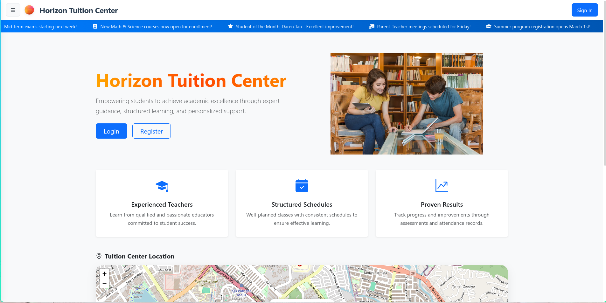

Horizon Tuition Center
======================

*Knowledge from across the horizon and beyond.*



About the Project
-----------------

> Empowering students to achieve academic excellence through expert guidance, 
> structured learning, and personalized support.

**Horizon Tuition Center** is a next-generation tuition center incorporating online
system to streamline the experience for both users and teachers.

This project is a college assignment for yet another web class, using ASP.NET framework
to create a multi functional MVC web application.

Requirements
------------

- [.NET 9.0](https://dotnet.microsoft.com/en-us/download) with [ASP.NET Core framework](https://dotnet.microsoft.com/en-us/apps/aspnet)
- [Docker](https://www.docker.com/)

Configuration
-------------

The configurations used are listed in [.env](.env).

Create a local copy of `.env` into `.env.local` and edit the values.

Development
-----------

### Deploying the services

Use Docker to start the associating services

```bash
docker compose up -f docker-compose.yaml -f docker-compose.dev.yaml -d
```

### Seeding the database

Run the following to update the database to the latest version

```bash
dotnet ef database update --project src/TuitionManagementSystem.Web/TuitionManagementSystem.Web.csproj
```

### Running the server

#### Development

```bash
dotnet run --project  src/TuitionManagementSystem.Web/TuitionManagementSystem.Web.csproj --launch-profile http
```

#### Production

```bash
dotnet run --project  src/TuitionManagementSystem.Web/TuitionManagementSystem.Web.csproj --launch-profile prod
```

License
-------

Licensed under the [GNU GPLv4](https://choosealicense.com/licenses/gpl-3.0/). See [LICENSE](LICENSE) for more information.
